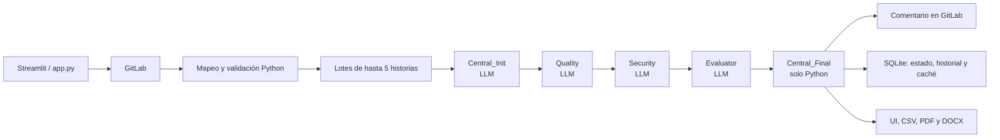

# Arquitectura y funcionamiento de la rama `llama3`

## 1. Resumen ejecutivo

Esta rama implementa una aplicación Streamlit para recibir historias de usuario desde GitLab, formalizarlas y evaluarlas con un flujo multiagente local basado en LangGraph, LangChain, Ollama y el modelo configurado (por defecto `llama3`).

El sistema no toma una decisión formal ni certifica que una historia sea correcta. Produce una evaluación asistida, publica un resumen como comentario en GitLab, conserva trazabilidad en SQLite y genera una matriz y documentos descargables. Toda salida queda marcada como pendiente de revisión humana.

El flujo real de agentes es:



Aunque el README afirma que Calidad y Seguridad se ejecutan en paralelo, en esta rama se ejecutan **secuencialmente** para no saturar el hardware:

`Central_Init → Quality → Security → Evaluator → Central_Final`.

## 2. Alcance funcional actual

La interfaz presenta cuatro etapas y las asocia a milestones homónimos:

| Etapa de UI | Milestone GitLab |
|---|---|
| Requerimientos | `Recepción de Requerimientos` |
| Diseño | `Diseño` |
| Codificación | `Codificación` |
| Pruebas | `Pruebas` |

Al probar la conexión inicial, la aplicación crea los milestones que falten y reutiliza los existentes. No crea duplicados por título exacto.

Hay una función `render_coming_soon()` que describe Diseño, Codificación y Pruebas como futuras, pero actualmente **no es llamada**. En consecuencia, seleccionar cualquiera de las cuatro etapas consulta los issues abiertos de su milestone y ofrece el mismo botón **Iniciar análisis**, ejecutando el mismo flujo de evaluación de requerimientos. Esto es relevante porque la intención visual y el comportamiento ejecutable todavía no coinciden.

## 3. Componentes principales

| Componente | Responsabilidad |
|---|---|
| `app.py` | UI Streamlit, configuración, navegación, consulta de issues, división en lotes, progreso y descargas |
| `integrations/gitlab_adapter.py` | Autenticación y operaciones directas con GitLab |
| `integrations/issue_mapper.py` | Conversión de Markdown de GitLab a JSON y validación previa |
| `integrations/issue_service.py` | Caso de uso completo: grafo, publicación, persistencia y resultado de lote |
| `core/graph.py` | Definición de nodos y aristas de LangGraph |
| `core/state.py` | Contrato del estado compartido del grafo |
| `agents/*.py` | Construcción de prompts y llamadas a Ollama |
| `prompts/*.txt` | Instrucciones y contratos JSON de cada agente |
| `core/batch_contract.py` | Parseo, conciliación, cálculo de métricas, validación y consolidación |
| `core/performance_audit.py` | Contadores, tiempos y tamaños aproximados de prompts/respuestas |
| `database/repository.py` | Seguimiento, historial y almacenamiento de caché |
| `project_config.py` | Configuración general y credenciales GitLab en SQLite |
| `core/utils.py` | Resúmenes, trazabilidad y generación de CSV/PDF/DOCX |

## 4. Arranque y configuración del proyecto

La aplicación se inicia con:

```bash
streamlit run app.py
```

`app.py` carga `.env` mediante `python-dotenv`, aunque esta dependencia no está declarada explícitamente en `requirements.txt`.

### 4.1 Variables de entorno

| Variable | Predeterminado | Uso |
|---|---|---|
| `OLLAMA_MODEL` | `llama3` | Modelo usado por todos los agentes |
| `OLLAMA_BASE_URL` | `http://localhost:11434` | Servidor Ollama |
| `ALLOW_INCOMPLETE_STORIES` | `false` | Permite o impide enviar historias incompletas al LLM |
| `GITLAB_URL` | sin valor | Valor inicial alternativo para el formulario |
| `GITLAB_TOKEN` | sin valor | Token GitLab |
| `GITLAB_PROJECT_ID` | sin valor | ID numérico o ruta `namespace/proyecto` |

La bandera `ALLOW_INCOMPLETE_STORIES` reconoce `1`, `true`, `yes`, `si` y `sí` como verdadero.

### 4.2 Configuración persistente

Antes de entrar a las etapas, el usuario debe completar:

- nombre y descripción del proyecto;
- objetivo general y objetivos específicos;
- alcance y actores;
- URL, proyecto y token de GitLab.

La aplicación obliga a probar primero la conexión. La prueba autentica contra GitLab, obtiene el proyecto y asegura los cuatro milestones. Solo después permite guardar.

Los datos se almacenan en `database/database.db`, tabla `project_configuration`. El contexto empieza en `v1.0` y aumenta la versión menor cuando cambia cualquier campo. Guardar exactamente los mismos valores no incrementa la versión.

Importante: el token GitLab queda dentro del `payload` JSON de SQLite, sin cifrado a nivel de aplicación.

## 5. Entrada desde GitLab

`GitLabAdapter` usa `python-gitlab` y:

1. autentica con `gl.auth()`;
2. obtiene el proyecto configurado;
3. lista milestones;
4. crea milestones faltantes;
5. lista issues abiertos filtrados por milestone;
6. obtiene un issue por IID;
7. publica notas/comentarios.

El flujo actual no actualiza labels en GitLab. Existe `construir_etiquetas_resultado()` para calcular labels coherentes, pero no se invoca ni existe en el adaptador un método productivo para guardarlas.

### 5.1 Plantilla esperada de una historia

El mapper busca encabezados Markdown de nivel 1 a 6:

```markdown
## Nombre
Registrar usuario

## Descripción
**Como** administrador
**Quiero** registrar un usuario
**Para** permitir su acceso

## Criterios de aceptación
- Se rechaza un correo duplicado

## Prioridad
Alta

## Restricciones
- El correo debe ser único

## Observaciones
Validar con el responsable
```

La extracción usa expresiones regulares y genera:

- `id`, `titulo` y `descripcion_original`;
- `actor`, `funcionalidad` y `objetivo`;
- listas de criterios y restricciones;
- prioridad, observaciones y labels;
- `validacion_entrada`.

Solo reconoce explícitamente `Alta`, `Media` o `Baja`. Si no encuentra prioridad, usa `Desconocida`.

### 5.2 Validación previa al LLM

Una historia es `informacion_insuficiente` si falta:

- título;
- descripción original;
- y no se identifica ninguno de actor, funcionalidad u objetivo.

La ausencia individual de actor, funcionalidad, objetivo, criterios, prioridad, restricciones u observaciones normalmente genera advertencias, no rechazo.

Con la configuración predeterminada, una historia insuficiente:

1. no se envía a Ollama;
2. recibe `NO_EVALUADO`;
3. se comenta en GitLab indicando campos faltantes;
4. se registra en SQLite como `Información insuficiente`.

Si `ALLOW_INCOMPLETE_STORIES=true`, también se incluye en el grafo, aunque conserva la información de validación para la consolidación.

## 6. Procesamiento por lotes

La UI divide todos los issues del milestone en lotes de máximo cinco:

```text
issues del milestone
    → [lote 1: hasta 5]
    → [lote 2: hasta 5]
    → ...
```

Los lotes se procesan uno después de otro. Dentro de cada lote los agentes también son secuenciales. No hay concurrencia entre lotes ni entre agentes.

El contexto de sprint enviado al Central contiene:

- nombre del proyecto;
- milestone;
- cantidad total de historias seleccionadas;
- títulos de todas las historias del milestone.

Por tanto, incluso cuando hay varios lotes, cada Central conoce los títulos globales, pero recibe el JSON detallado únicamente de las historias de su lote.

## 7. Estado compartido en LangGraph

`AgentState` transporta:

| Campo | Productor / consumidor |
|---|---|
| `project_name` | UI → Central |
| `sprint_context` | UI → Central |
| `issues_data` | mapper → todos los nodos |
| `central_init` | Central → Calidad, Seguridad y consolidación |
| `quality_report` | Calidad → Evaluador y consolidación |
| `security_report` | Seguridad → Evaluador y consolidación |
| `evaluation` | Evaluador → consolidación |
| `final_report` | Central final → servicio |
| `validation_errors` | acumulación de errores estructurales |
| `content_validation_errors` | advertencias de contenido agrupadas por IID |

Cada salida de agente viaja como texto JSON. Los nodos la parsean y normalizan antes de volverla a serializar.

## 8. Agentes y prompts

Todos los agentes LLM usan `ChatOllama`, modo JSON (`format="json"`), contexto de 8192 tokens y `keep_alive="30m"`.

### 8.1 Agente Central inicial

Archivo: `agents/central_agent.py`  
Prompt: `prompts/central_prompt.txt`

Recibe el nombre del proyecto, contexto del milestone, IDs obligatorios y JSON mapeado. Su tarea es formalizar cada historia sin evaluar calidad ni seguridad.

Debe producir, por historia:

- identidad: `issue_iid`, `historia_id`, título, actor, objetivo y prioridad;
- requerimientos formales;
- restricciones;
- ambigüedades;
- información faltante;
- observaciones.

Cada requerimiento debe incluir `temp_id`, nombre, descripción que comience exactamente con **“El sistema deberá”**, tipo (`RF`, `RNF`, `RS` o `RC`), origen, justificación y prioridad.

El prompt insiste en conservar los IID reales porque los modelos tienden a reemplazarlos por ordinales `1..N`.

### 8.2 Agente de Calidad

Archivo: `agents/quality_agent.py`  
Prompt: `prompts/quality_prompt.txt`

Recibe exclusivamente la salida estructurada del Central. Se presenta como basado en ISO/IEC 25023 y debe identificar evidencia para:

- `cobertura_funcional`;
- `adecuacion_funcional`.

El LLM **no calcula porcentajes**. Enumera elementos evaluados, problemáticos y alineados, y escribe justificaciones y recomendaciones. Python calcula:

```text
cobertura = 1 - elementos_con_problemas / elementos_evaluados
adecuación = elementos_alineados / elementos_evaluados
índice_calidad = promedio de métricas evaluables
meta = índice_calidad >= 0.95
```

Si no hay evidencia, la métrica queda con valor `null` y estado `evidencia_insuficiente`; no se transforma en un 100 % artificial.

### 8.3 Agente de Seguridad

Archivo: `agents/security_agent.py`  
Prompt: `prompts/security_prompt.txt`

También recibe la salida del Central. Se presenta como basado en ISO/IEC 27034 y aporta evidencia para:

- cobertura documental de controles de seguridad;
- asignación justificada de LoT (`LoT-1`, `LoT-2` o `LoT-3`).

Python calcula:

```text
controles = requerimientos_con_controles / requerimientos_evaluados
LoT justificado = requerimientos_con_lot_justificado / requerimientos_evaluados
índice_seguridad = promedio de métricas evaluables
meta = índice_seguridad >= 0.85
```

El LoT es un nivel de aseguramiento recomendado, no la confianza del modelo.

### 8.4 Agente Evaluador

Archivo: `agents/evaluator_agent.py`  
Prompt: `prompts/evaluator_prompt.txt`

El evaluador recibe una entrada reducida, formada por la intersección de IID presentes tanto en Calidad como en Seguridad. Para cada IID incluye ambos reportes completos.

Usa temperatura `0.0` y debe devolver:

- `APROBADO`, `CORREGIR` o `ALERTA`;
- riesgos críticos;
- correcciones obligatorias;
- conclusión específica.

El veredicto que llega al resultado productivo es actualmente el del LLM. La función `ajustar_veredicto_determinista()` puede forzar `ALERTA` o `CORREGIR` según riesgos, evidencia e índices, y sus pruebas cubren ese comportamiento, pero **no se llama desde el grafo ni desde el servicio** en esta rama.

### 8.5 Central final

El nodo `Central_Final` no llama a un modelo. Consolida en Python, une resultados por `issue_iid`, renumera requerimientos y calcula el resumen global.

Existe `prompts/central_output_prompt.txt`, pero es un artefacto heredado/no utilizado por el flujo actual.

## 9. Presupuesto de generación

El límite `num_predict` crece con el número de historias y tiene un máximo:

| Agente | Fórmula | Máximo |
|---|---:|---:|
| Central | `500 + 280 × historias` | 2100 |
| Calidad | `450 + 260 × historias` | 1750 |
| Seguridad | `500 + 300 × historias` | 2000 |
| Evaluador | `200 + 110 × historias` | 850 |

En un lote de cinco historias los valores son 1900, 1750, 2000 y 750 respectivamente.

Si una respuesta no es JSON válido o queda truncada, el nodo reintenta una sola vez con un presupuesto fijo mayor:

| Agente | Presupuesto de reintento |
|---|---:|
| Central | 2800 |
| Calidad | 2400 |
| Seguridad | 2800 |
| Evaluador | 1400 |

El reintento ocurre por fallo de parseo, no por cada advertencia de contenido.

## 10. Contratos, normalización y reparación

Esta capa es esencial porque el sistema no confía ciegamente en la salida del LLM.

### 10.1 Recuperación de JSON

El parser:

1. acepta un diccionario ya parseado;
2. elimina cercas Markdown como ````json`;
3. intenta `json.loads`;
4. si hay prosa adicional, busca el primer objeto JSON completo;
5. exige un objeto con el arreglo `resultados`.

### 10.2 Conciliación de IID

Antes de validar, el sistema intenta corregir IDs inventados de forma inequívoca:

1. conserva IID reales únicos;
2. relaciona por título único;
3. traduce ordinales `1..N` a los IID esperados;
4. como último recurso seguro, alinea por posición si ningún IID devuelto pertenece al conjunto real.

La consolidación final siempre cruza por `issue_iid`, no por posición.

### 10.3 Reparación selectiva

Después de normalizar métricas, solo las historias completamente ausentes disparan otra llamada selectiva al agente correspondiente. Los campos textuales secundarios inválidos quedan como advertencias y no provocan más llamadas.

Existe `security_repair_prompt.txt` para reparar campos concretos, pero el flujo actual de reparación no lo utiliza: vuelve a invocar el prompt normal de Seguridad sobre el subconjunto faltante.

### 10.4 Limpieza de evidencia

Python:

- elimina vacíos, `N/A`, puntos suspensivos y textos de ejemplo;
- normaliza mayúsculas, acentos, espacios y puntuación para comparar;
- elimina duplicados;
- restringe “alineados”, “con controles” y “con LoT” al universo realmente evaluado;
- agrega una recomendación conservadora si el índice es menor a 1 y el agente la omitió.

### 10.5 Validación estructural y de contenido

Se comprueba:

- un resultado por IID esperado;
- ausencia de duplicados o IID inesperados;
- índices numéricos entre 0 y 1, salvo estados no evaluables;
- estructura de requerimientos;
- justificaciones específicas;
- recomendaciones requeridas;
- veredictos permitidos.

Los errores estructurales pueden marcar la historia como error. Las observaciones textuales se acumulan en `warnings`.

## 11. Consolidación y trazabilidad

El Central final:

1. indexa las cuatro salidas por IID;
2. renumera globalmente requerimientos por tipo (`RF-001`, `RNF-001`, etc.);
3. copia `descripcion_formal` a `descripcion`;
4. normaliza `procedencia` a `extraido`, `inferido` o `recomendado`;
5. distingue estado técnico, evaluación y revisión humana;
6. calcula promedios únicamente con índices numéricos evaluables.

Cada historia consolidada contiene:

- `status`: éxito/error técnico;
- `estado_procesamiento`: completo, error o información insuficiente;
- `estado_evaluacion`: veredicto o `NO_EVALUADO`;
- errores y advertencias;
- resultados de los cuatro roles;
- validación de entrada;
- `revision_humana_requerida=true`;
- `estado_revision_humana="pendiente"`.

Este diseño evita confundir “el pipeline terminó” con “la historia fue aprobada”.

## 12. Publicación y persistencia

### 12.1 Comentarios en GitLab

Para una historia procesada correctamente se publica:

- estado orientativo;
- índice de calidad;
- cobertura documental de seguridad;
- LoT recomendado;
- hasta tres recomendaciones/hallazgos;
- próxima acción;
- aviso de decisión humana.

Si falla la publicación, el análisis permanece en el resultado y se agrega `gitlab_error`.

Si una historia tiene error estructural, no se publica el comentario normal ni se guarda historial. Si es insuficiente, se publica un comentario específico.

### 12.2 SQLite

La base `database/database.db` contiene:

- `project_configuration`: contexto y credenciales;
- `issues`: IID, hash y estado de seguimiento;
- `history`: métricas, veredicto, tiempo y conclusión por ejecución;
- `cache_results`: salidas JSON por hash y versión de esquema.

El esquema de caché actual es `v4-assisted-evaluation`.

Aunque la aplicación guarda resultados en caché y existe `obtener_cache()`, el flujo productivo **no consulta esa caché antes de invocar Ollama**. Por tanto, “Limpiar Base de Seguimiento (Caché e Historial)” borra datos persistidos, pero la caché no está reduciendo llamadas actualmente.

El botón de limpieza elimina filas de `issues`, `history` y `cache_results`, pero conserva la configuración general.

## 13. Resultados visibles y documentos

Al finalizar, Streamlit conserva el último resultado en `st.session_state` y muestra:

- resumen global;
- promedios de calidad y seguridad;
- conteo de veredictos y requerimientos;
- resultados por historia;
- métricas, riesgos y recomendaciones;
- estado de publicación en GitLab;
- matriz de trazabilidad;
- descarga CSV;
- generación bajo demanda de PDF ejecutivo;
- generación bajo demanda de DOCX formal consolidado.

El estado de sesión también mantiene issues por etapa, resultados procesados y archivos generados. Estos datos son efímeros y se pierden al reiniciar la sesión de Streamlit; la trazabilidad permanente queda en SQLite y GitLab.

## 14. Auditoría y logs

`logs/execution.log` recibe:

- inicio y fin de cada nodo;
- duración;
- reintentos;
- eventos `PERF_AUDIT`;
- modelo y parámetros;
- tamaño del prompt, contexto y respuesta;
- estimación aproximada de tokens como `caracteres / 4`;
- cantidad de llamadas por agente.

El contenido completo del prompt y respuesta no se escribe explícitamente por la capa de auditoría; se registran tamaños y metadatos. Las excepciones y otros logs pueden añadir información adicional.

Los contadores se reinician por llamada a `procesar_flujo_lote`, es decir, por lote, no por ejecución completa de todos los lotes del milestone.

## 15. Manejo de errores

Los principales niveles son:

1. **Configuración:** Streamlit detiene la ejecución si falta configuración o GitLab no conecta.
2. **Entrada:** historias insuficientes se filtran antes del LLM por defecto.
3. **LLM:** JSON inválido genera un único reintento.
4. **Contrato:** IID faltantes generan reparación selectiva.
5. **Consolidación:** faltantes o estructuras inválidas producen una historia con `status="error"`.
6. **Lote:** una excepción se captura en la UI y el resto de lotes continúa.
7. **GitLab:** una publicación fallida se registra sin descartar el análisis.

No hay transacción distribuida entre GitLab y SQLite; es posible que un comentario se publique y falle después la persistencia, o viceversa.

## 16. Diferencias entre intención, documentación y ejecución

Estos puntos son especialmente importantes al mantener la rama:

1. El README dice que Calidad y Seguridad son paralelos; el grafo los ejecuta secuencialmente.
2. El README describe evaluación de código con Radon y Semgrep; el flujo principal actual evalúa historias de usuario. Los módulos `tools/radon_tool.py` y `tools/semgrep_tool.py` no participan en el grafo.
3. `central_output_prompt.txt` no se utiliza; el Central final es Python.
4. `security_repair_prompt.txt` no se utiliza en la reparación actual.
5. `ajustar_veredicto_determinista()` está probado, pero no conectado.
6. `construir_etiquetas_resultado()` está probado, pero no se publican labels.
7. La caché se escribe, pero no se lee durante el análisis.
8. `render_coming_soon()` existe, pero las cuatro etapas ejecutan hoy el mismo análisis.
9. La descripción de la UI dice “caché e historial”, pero también se borra la tabla local de seguimiento de issues.
10. Los datos descriptivos generales del proyecto se guardan y se muestran, pero el prompt Central solo recibe el nombre y el contexto resumido del sprint; descripción, objetivos, alcance, actores y `context_version` no se incorporan al prompt.

## 17. Ejemplo de ejecución completa

Para un milestone con siete issues:

1. Streamlit consulta siete issues abiertos.
2. Construye dos lotes: cinco y dos.
3. Mapea y valida el primer lote.
4. Las historias insuficientes se excluyen por defecto.
5. Central formaliza requerimientos para las válidas.
6. Calidad identifica evidencia; Python calcula sus métricas.
7. Seguridad identifica controles y LoT; Python calcula sus métricas.
8. Evaluador emite un veredicto por IID común.
9. Central final cruza, valida y renumera.
10. El servicio publica comentarios y guarda seguimiento.
11. Se repite el proceso para el segundo lote.
12. La UI combina ambos resultados y ofrece trazabilidad y documentos.

Con siete historias válidas y sin reintentos se realizan ocho llamadas a Ollama: cuatro por cada lote. Las consolidaciones finales no consumen LLM.

## 18. Pruebas existentes

Las pruebas cubren, entre otros:

- variantes de encabezados Markdown;
- clasificación de entrada incompleta;
- cálculo seguro de métricas;
- eliminación de duplicados y placeholders;
- evidencia fuera del universo;
- métricas no aplicables/no evaluables;
- conciliación y validación de contratos;
- presupuestos dinámicos;
- recuperación de JSON con cercas Markdown;
- lógica de veredicto determinista;
- trazabilidad y revisión humana;
- generación DOCX;
- versionado de configuración;
- creación idempotente de milestones.

Debe notarse que algunas pruebas verifican funciones disponibles, pero no necesariamente su integración en el camino productivo, como el ajuste determinista y las etiquetas.

## 19. Configuración recomendada para operar esta rama

1. Mantener Ollama activo y descargar el modelo indicado por `OLLAMA_MODEL`.
2. Usar historias que sigan la plantilla Markdown esperada.
3. Limitar los cambios de prompt junto con cambios de `SCHEMA_VERSION`.
4. Tratar el token almacenado en SQLite como secreto y restringir acceso al archivo.
5. Revisar `logs/execution.log` cuando existan truncamientos o lentitud.
6. Verificar manualmente comentarios, métricas y LoT: todos son apoyo a la decisión.
7. No asumir que la caché evita reevaluaciones ni que las labels se actualizaron.
8. No interpretar el veredicto del LLM como aprobación humana.

## 20. Archivos clave para continuar el desarrollo

- Entrada/UI: `app.py`
- Flujo de negocio: `integrations/issue_service.py`
- Grafo: `core/graph.py`
- Contrato y métricas: `core/batch_contract.py`
- Prompts: `prompts/central_prompt.txt`, `quality_prompt.txt`, `security_prompt.txt`, `evaluator_prompt.txt`
- Configuración de modelo: `core/config.py` y `agents/__init__.py`
- Integración GitLab: `integrations/gitlab_adapter.py`
- Persistencia: `database/repository.py` y `project_config.py`
- Pruebas: `tests/`

