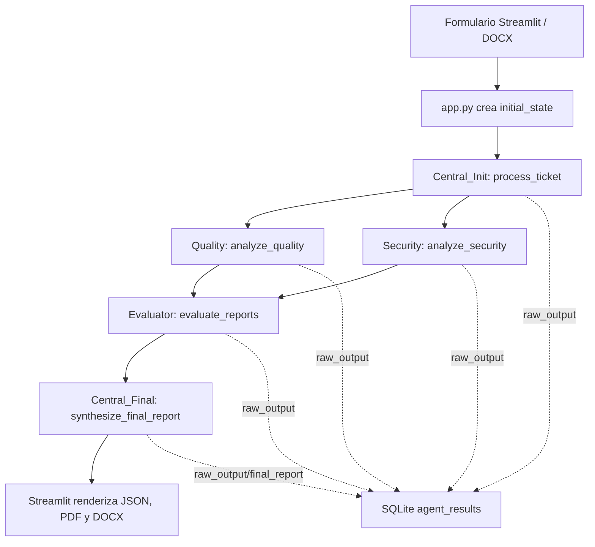

# Auditoria de Rendimiento de la Herramienta Multiagente

Fecha de auditoria: 2026-07-08  
Proyecto auditado: `modelo-multiagente-dev`  
Ejecucion base analizada: `execution_id=20` en `trazabilidad.db`

## 1. Resumen ejecutivo

El sistema ejecuta un flujo de 5 llamadas a Ollama por analisis completo:

1. `Central_Init`
2. `Quality`
3. `Security`
4. `Evaluator`
5. `Central_Final`

El cuello de botella observado en la linea base historica es `Central_Final`, con aproximadamente `2137.76 s` entre la finalizacion del Evaluador y el registro del reporte final. Representa cerca del `55.07%` del tiempo total de la ejecucion base.

El grafo de LangGraph si esta definido con ramas paralelas para `Quality` y `Security`. Una prueba minima del runtime local mostro que dos nodos derivados de un mismo nodo inicial se ejecutan solapados. Sin embargo, la evidencia historica en SQLite solo registra tiempos de finalizacion, no tiempos de inicio, por lo que no prueba por si sola si Ollama proceso ambas solicitudes simultaneamente o si las serializo internamente. Para cerrar esa brecha se agrego instrumentacion temporal con eventos `node_start`, `node_end`, `agent_start` y `agent_end`.

## 2. Flujo real encontrado

Secuencia logica:

| Orden | Nodo | Entrada principal | Salida |
|---:|---|---|---|
| 1 | `Central_Init` | `project_name`, `requirements_text` | JSON intermedio formalizado |
| 2 | `Quality` | `central_init` | JSON de metricas ISO/IEC 25023 |
| 2 | `Security` | `central_init` | JSON de metricas ISO/IEC 27034 |
| 3 | `Evaluator` | `quality_report`, `security_report` | JSON de veredicto |
| 4 | `Central_Final` | Todos los JSON anteriores | JSON con resumen, documento formal y matriz |

## 3. Llamadas a Ollama

Todas las llamadas pasan por `agents.get_llm(json_mode=True)`.

Configuracion encontrada:

| Parametro | Valor |
|---|---|
| Modelo | `OLLAMA_MODEL`, default `llama3` |
| Base URL | `OLLAMA_BASE_URL`, default `http://localhost:11434` |
| Temperatura | `0.2` |
| Formato | `json` |
| `num_ctx` | No configurado en codigo |
| `num_predict` | No configurado en codigo |
| Otros parametros | No configurados en codigo |

Conclusion: todos los agentes usan el mismo modelo y los mismos parametros. La longitud efectiva de contexto y el limite de generacion quedan en los defaults del modelo/Ollama, no en una configuracion explicita de la aplicacion.

## 4. Evidencia de paralelismo

Definicion del grafo:

| Evidencia | Observacion |
|---|---|
| `workflow.add_edge("Central_Init", "Quality")` | Rama Calidad sale de Central |
| `workflow.add_edge("Central_Init", "Security")` | Rama Seguridad sale de Central |
| `workflow.add_edge("Quality", "Evaluator")` | Evaluador espera Calidad |
| `workflow.add_edge("Security", "Evaluator")` | Evaluador espera Seguridad |

Prueba minima del runtime local:

| Prueba | Resultado |
|---|---|
| Dos nodos hermanos con `sleep(2)` | Ambos iniciaron en el mismo segundo |
| Tiempo total medido | `~2.01 s` |
| Tiempo esperado si fuera secuencial | `~4 s` |

Interpretacion: LangGraph ejecuta las ramas hermanas de forma concurrente en este entorno. Lo que aun debe medirse en una ejecucion real instrumentada es si Ollama atiende las dos solicitudes en paralelo o si el servidor/modelo local las serializa.

## 5. Instrumentacion agregada

Se agrego instrumentacion temporal sin modificar el comportamiento funcional:

| Archivo | Cambio |
|---|---|
| `core/performance_audit.py` | Nuevo helper de auditoria |
| `core/graph.py` | Eventos `node_start` y `node_end` por nodo |
| `agents/central_agent.py` | Medicion de prompt, contexto, respuesta y parametros |
| `agents/quality_agent.py` | Medicion de prompt, contexto, respuesta y parametros |
| `agents/security_agent.py` | Medicion de prompt, contexto, respuesta y parametros |
| `agents/evaluator_agent.py` | Medicion de prompt, contexto, respuesta y parametros |

Cada llamada registra:

| Campo | Descripcion |
|---|---|
| `started_at` / `finished_at` | Hora de inicio y finalizacion |
| `elapsed_seconds` | Tiempo total |
| `model` | Modelo utilizado |
| `model_params` | Parametros configurados |
| `prompt_size` | Caracteres, bytes UTF-8 y tokens aproximados |
| `context_size` | Caracteres, bytes UTF-8 y tokens aproximados del contexto recibido |
| `input_json_size` | Tamano normalizado del JSON recibido, cuando aplica |
| `response_size` | Caracteres, bytes UTF-8 y tokens aproximados |
| `response_json_size` | Tamano normalizado del JSON de respuesta, cuando aplica |

Los registros quedan en `logs/execution.log` con prefijo `PERF_AUDIT`.

## 6. Baseline de rendimiento

Fuente: `trazabilidad.db`, ejecucion completa `id=20`.

| Metrica | Valor actual |
|---|---:|
| Tiempo total | `3881.52 s` |
| Numero de llamadas a Ollama | `5` |
| Tiempo Agente Central Init | `636.55 s` |
| Tiempo Calidad | `422.90 s` inferido desde fin de Central Init |
| Tiempo Seguridad | `874.63 s` inferido desde fin de Central Init |
| Tiempo Evaluador | `232.57 s` |
| Tiempo Central Final | `2137.76 s` |
| Tamano promedio de respuesta | `2919.40 chars` |
| Tamano promedio de prompt conocido | `6523.25 chars` |
| Paralelismo real del grafo | `Si` |
| Paralelismo real de Ollama | `Pendiente de confirmar con logs agent_start/agent_end` |
| Modelo utilizado | `llama3` por default, salvo override de `OLLAMA_MODEL` |

Nota: los tiempos de Calidad y Seguridad se infieren desde la finalizacion de `Central_Init`, porque la base historica no guardaba timestamps de inicio por agente. Tras la instrumentacion, esos tiempos quedan registrados directamente.

## 7. Tabla por agente

Fuente de tamanos: outputs historicos de `agent_results` y prompts reconstruibles con los JSON disponibles. El prompt de `Central_Init` no puede reconstruirse exactamente porque el texto original de requerimientos no se guarda en SQLite.

| Agente | Tiempo | Tamano Prompt | Tamano Contexto | Tamano JSON Recibido | Tamano Respuesta |
|---|---:|---:|---:|---:|---:|
| Central Init | `636.55 s` | No disponible | No disponible | No aplica | `2967 chars` |
| Calidad | `422.90 s` inferido | `5199 chars` | `2967 chars` | `2637 chars` | `2248 chars` |
| Seguridad | `874.63 s` inferido | `5382 chars` | `2967 chars` | `2637 chars` | `1927 chars` |
| Evaluador | `232.57 s` | `5790 chars` | `4176 chars` | `3929 chars` | `266 chars` |
| Central Final | `2137.76 s` | `9722 chars` | `7411 chars` | Mixto / multiples JSON | `7189 chars` |

## 8. Analisis de contexto y redundancias

Observaciones:

| Punto | Evidencia | Riesgo |
|---|---|---|
| `Quality` y `Security` reciben el mismo JSON central completo | Ambos usan `state["central_init"]` | Duplicacion necesaria por arquitectura actual, pero costosa |
| `Central_Final` recibe todos los resultados completos | Prompt reconstruido: `9722 chars` | Mayor contexto y mayor salida; principal candidato a cuello de botella |
| `Evaluator` recibe reportes completos de Calidad y Seguridad | Contexto: `4176 chars`; respuesta: `266 chars` | Su salida es pequena; no parece cuello de botella |
| Prompts incluyen instrucciones y esquemas JSON extensos | Templates entre `1666` y `2457 chars` | Costo fijo alto en cada llamada |
| `num_predict` no esta limitado | No aparece configurado | Respuestas largas pueden crecer sin control, especialmente Central Final |
| `num_ctx` no esta fijado | No aparece configurado | Riesgo de truncamiento o comportamiento dependiente del modelo |

## 9. Cuello de botella

El componente mas costoso en la baseline es `Central_Final`.

Evidencia:

| Componente | Tiempo | Porcentaje del total |
|---|---:|---:|
| Central Init | `636.55 s` | `16.40%` |
| Calidad | `422.90 s` inferido | `10.90%` |
| Seguridad | `874.63 s` inferido | `22.53%` |
| Evaluador | `232.57 s` | `5.99%` |
| Central Final | `2137.76 s` | `55.07%` |

Hipotesis tecnica principal: `Central_Final` combina el mayor prompt reconstruido (`9722 chars`) con la mayor respuesta (`7189 chars`). En modelos locales, el tiempo suele estar fuertemente correlacionado con tokens de entrada mas tokens generados; por eso el nodo final domina.

Hipotesis secundaria: si Ollama serializa solicitudes concurrentes o el hardware queda saturado, `Quality` y `Security` pueden solaparse a nivel de grafo pero no aprovechar paralelismo efectivo de inferencia.

## 10. Optimizaciones posibles sin modificar arquitectura

| Prioridad | Mejora | Beneficio esperado | Dificultad |
|---:|---|---|---|
| 1 | Configurar `num_predict` por agente, especialmente `Central_Final` | Reducir tiempo de generacion y evitar respuestas excesivas | Baja |
| 2 | Configurar `num_ctx` explicitamente segun el modelo | Evitar defaults opacos y truncamientos | Baja |
| 3 | Reducir verbosidad del prompt de `Central_Final` | Alto impacto sobre el mayor nodo | Media |
| 4 | Pedir salidas mas compactas en Calidad y Seguridad | Menor contexto para Evaluador y Central Final | Media |
| 5 | Separar en logs duracion de espera HTTP vs generacion si la libreria expone metadatos | Diagnostico mas fino de Ollama | Media |
| 6 | Mantener templates comunes o instrucciones compartidas fuera de cada prompt si se cambia estrategia luego | Menos tokens repetidos | Media |
| 7 | Registrar el texto inicial de requerimientos o su hash/tamano en BD | Baselines completas y reproducibles | Baja |
| 8 | Revisar capacidad de paralelismo de Ollama/hardware | Confirmar si conviene concurrencia real o ejecucion secuencial controlada | Media |

## 11. Conclusiones

1. El flujo completo realiza 5 llamadas a Ollama.
2. El grafo si define y ejecuta ramas paralelas para Calidad y Seguridad en el runtime local.
3. La eficiencia real de paralelismo en Ollama queda pendiente de confirmar con la instrumentacion agregada.
4. `Central_Final` es el cuello de botella observado por tiempo, tamano de prompt y tamano de respuesta.
5. El modelo se usa de forma uniforme en todos los agentes, pero con parametros incompletos: no hay `num_ctx` ni `num_predict`.
6. La mayor optimizacion sin cambiar arquitectura esta en limitar y compactar la generacion final.
